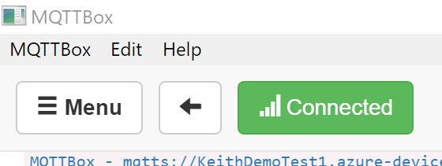

# <p style ="text-align: center;">Connecting MQTTBox to IoT Hub</p>
We recently had a customer who wanted to use MQTTBox to test some messages into IoT Hub.  They were struggling getting MQTTBox to connect, so we was trying to help them.  Digging into the connectivity issues with them resulted in us understanding how to get MQTTBox to connect to Azure.  The below article is the result of that journey, and if you are struggling with MQTTBox we hope it helps you out too.

## Step 1 
---

The first step in this journey is to download and install MQTTBox.  If you are running a Windows operating system then you are in luck as you can install it from the Windows Store.  For detail instuctions see this [link](http://workswithweb.com/mqttbox.html).

<b>Note: </b><i>  For the purposes of this document we will not be focused on how to install MQTTBox, but rather how to connect it.</i>

## Step 2
---

Now that MQTTBox is intalled lets look at how to configure it.  In this step we are assuming that you have an IoT Hub configured in Azure.  If you need help on how to create an IoT Hub in Azure please see this [article](https://docs.microsoft.com/en-us/azure/iot-hub/).

## Step 3
---
There are many different ways that you can create an IoT Device in Azure IoT Hub, however, we will be creating ours in the Azure Portal.

Open up a web browser of your choice and naviage to the [Azure Portal](portal.azure.com).  Once there navigate to your IoT Hub.  Now we will create an IoT Device that we will use to connect MQTTBox to.

In the IoT Hub blade find IoT Devcies on the left hand side as shown below:


From there click on "ADD" 


On this screen you need to only give the IoT Device a name:


And click save.

<b>Note: </b><i>For this walkthrough we will be using MQTTBox as the name.</i>


At this point we will need to get a few setting details for our MQTTBox connection, and since we are in the Azure Portal there is no time like the present.

<i>Stuff needed</i>
* Device Name:
* IoT Hub URI:
* Generate a Device SAS Token

So the first thing on our list is easy.  It is the device name that you used when you created the device.  If you need to know where to find this in the Portal, simply click on the device and on the next blade you will see:


Next on our list is the IoT Hub URI.  You can get this from clicking on the "Overview" section of the IoT Hub blade:


The last one requires a bit of more work.  There are several different ways to generate a SAS token, I will cover how to create one from the Azure Portal with the Cloud Shell in Bash mode.

* Open a cloud shell.  If you are not familiar with this option click on the icon as seen below:


* Run the following command:
```Bash
az iot hub generate-sas-token -n{IoT Hub Name} -d {IoT Device Name} --du {duration in Seconds}
``` 
<b>Note:</b><i> You will need to have the IoT Hub extension installed in your cloud shell.  If you do not have this extenstion you can install it by running the following command.  
```Bash
az extension add --name azure-cli-iot-ext
```
</i> 

Copy the newly created SAS Token from the Cloud shell window
Your MQTTBox should open up and look like the image below:


## Back to MQTTBox
Now that we have the requred data we can go back to the MQTTBox program.  It should look like the image below:


We will cover the important sections of MQTTBox in detail for connection to IoT Hub. 

* <b>MQTT Connection Name</b> - This is any name that you want to give the connection, only visible in MQTTBox.
* <b>MQTT Client ID</b> - This is the Azure IoT Device name from above.
* <b>Host</b> - This is the Azure IoT Hub URI, and we will need to modify this a little bit.  The entire connection string should look like:  {IoT Hub Name}.azure-devices.net/$iothub/websocket

<b>Note:</b><i>IoT Device SDK handles some of our connection info, but MQTTBox was not written using our SDK, so this field needs to get appended with the following:  /$iothub/websocket</i>

* <b>Username</b> - is the FQDN name of the IoT Device, with some additional information.  It should look like the following:  {IoT Hub Name}.azure-devices.net/{Device Name}/?api-version=2018-06-30
* <b>Password</b> - is the SAS token that was generated from above.
* <b>Append timestamp to MQTT client id</b> -This sould be set to "No".
* <b>SSL/TLS Version</b> - This should be set to Auto.
* <b>Will - QoS</b> - This should be set to 1
* <b>SSL/TSL Certificate Type</b> - This should be set to CA signed server certificate.

Your MQTT Client Settings in MQTTBox should look like:


Click Save:

If all went well you should see a green connected button at the top of MQTTBox.



## Topic to publish
---
Now that we have our MQTTBox connected it is time to test the connection.  However, we have one last field that we need to set, and that is the MQTT Topic.  Azure has a topic structure that we need to set for the device.  The topic is "devices/{IoT Device Name}/messages/events/ (yes the trailing / is required.)  Once that is set we are all good to test that "hello world" message.  

* In the Payload box type "hello world"
* click the Publish button:


Now to check if IoT Hub got that message.  Back in Azure Portal, and hopefully you still have the Bash cloud shell open.  If not you can refer above on how to open the cloud shell.  You can type in 
```Bash
az iot hub monitor-events -n {IoT Hub Name}
```
press enter and now you are "echoing" out the IoT Hub messages as they hit the IoT Hub.  

Go back to MQTTBox and click publish again and this time go back to the cloud shell you should see that you did in fact get the message delivered to IoT Hub.


I hope that you have enjoyed this article, please feel free to leave a comment below.


